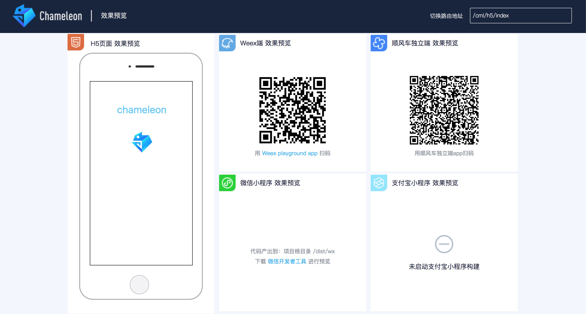
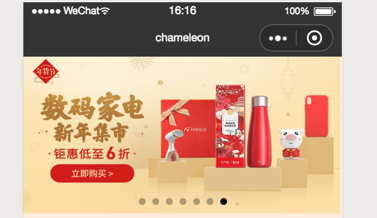
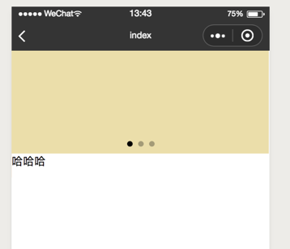

# 手把手教你系列- 实现复杂应用
## 背景介绍
 我们今天用`chameleon`来做一个网易严选项目，实现一套`cml`代码在web、小程序、Native当中运行的目标。在此项目中呢，我会介绍大家日常开发过程当中关心的一些点，
   比如路由、状态管理、页面设计、本地数据请求、组件设计及组件扩展、多态等等，以及多端的差异化需求。
## 1 背景介绍——仿网易严选

### 1 准备

- 执行 `npm i -g @didi/chameleon-cli`，安装全局chameleon-cli环境；安装成功后，执行`cml -v`查看当前版本；

### 2 初始化项目

- 执行`cml init project`
- 请输入项目名
- 等待自动执行npm install依赖
- 切换到项目根目录执行`cml dev`
- 会自动打开预览界面 预览界面如下：




### 3 构建首页
我们准备一组tab数据，放进state里面；
- 改造`store/state.js`文件如下：

```shell
const state = {
  tabs: [
    {label: '首页'},
    {label: "分类"},
    {label: '识物'},
    {label: '购物车'},
    {label: '个人1'}
  ]
}
export default state

```

#### 3.1 执行`cml init component`，选择普通组件，输入 `home`,回车之后我们在项目结构中可以看到，`src/components`下面多了一个`home`文件夹，文件夹里面有一个`home.cml`文件；

- 在`src/components/home`下面新建一个`tab.cml`文件；（复制`home.cml`文件到`src/components`，重命名`tab`即可）；
- 我们选择chameleon内置组件`c-tabs`来作为底部tab；
- 文件`components/home/tab.cml` 代码如下：

```shell
<template>
  <view class="tab">
    <c-tabs tabs="{{tabs}}"
      c-bind:tabclick="handleTabTap"
      active-label="{{activeLabel}}"
      inline="{{false}}"
      has-underline="{{false}}"
    >
    </c-tabs>
  </view>
</template>

<script>
import store from '../../store'
class Index {
  data = {
    animationData: {},
    tabs:[ ],
    activeLabel: '首页',
  }
  methods = {
    handleTabTap(e) {
      const oIndex = e.detail.activeIndex;
      this.activeLabel = e.detail.label;
      this.$cmlEmit('translate', { oIndex });
    }
  }
  created (){
    this.tabs = store.state.tabs;
  }
}

export default new Index();
</script>
<script cml-type="json">
{
  "base": {
    "usingComponents": {
        "c-tabs": "cml-ui/components/c-tab/c-tab"
    }
  },
  ...
}
</script>

```

#### 3.2 把我们刚才定义的组件引入到页面`page/index/index.cml`，修改`index.cml`文件配置；

```shell
<script cml-type="json">
{
  "base": {
    "usingComponents": {
      "tab": "/components/home/tab"
    }
  },
  ...
}
</script>

```

我们可以看到页面如图，鼠标滑至图中箭头指向位置，点击打开web端。


#### 3.3 在首页添加页面元素

更改`page/index/index.cml`文件，代码如下：

```javascript
<template>
  <page title="chameleon">
    <view class="page-container">
      <scroller height="{{winHeight}}">
          <view c-animation="{{animationData}}" class="content-main">
            <view c-bind:click="click(0)" class="main1">11</view>
            <view c-bind:click="click(1)" class="main2">22</view>
            <view c-bind:click="click(2)" class="main3">33</view>
            <view c-bind:click="click(3)" class="main4">44</view>
            <view c-bind:click="click(4)" class="main5">55</view>
          </view>
      </scroller>
      <tab c-bind:translate="transition" class="footer"></tab>
    </view>
  </page>
</template>
<script>
  import cml from 'chameleon-api';
  const animation = cml.createAnimation();
  class Index  {
    data = {
      title: "chameleon",
      winHeight: 0,
      chameleonSrc: require('../../assets/images/chameleon.png'),
      animationData: {}
    }
    methods = {
      transition(info){
        console.log(info);
        const { oIndex } = info.detail;
        this.animationData = animation.translateX( oIndex * -750 ).step({duration: 0}).export();
      }
  
    }
  
    mounted() {
      cml.getSystemInfo().then((info)=>{
        this.winHeight = Number(info.viewportHeight) - 140;
      })
    }
  }
</script>
<style scoped>
  .page-container {
    background: aqua;
  }
  .content-main {
    display: flex;
    flex-flow: row nowrap;
  }
  .main1 {
    width: 750cpx;
    height: 200cpx;
    background: pink;
  }
  .main2 {
    width: 750cpx;
    height: 200cpx;
    background: deeppink;
  }
  .main3 {
    width: 750cpx;
    height: 200cpx;
    background: red;
  }
  .main4 {
    width: 750cpx;
    height: 200cpx;
    background: burlywood;
  }
  .main5 {
    width: 750cpx;
    height: 200cpx;
    background: antiquewhite;
  }
  .footer {
    width: 750cpx;
    height: 140cpx;
    position: fixed;
    bottom: 0;
    left: 0;
    z-index: 500;
  }
</style>
<script cml-type="json">
{
  "base": {
    "usingComponents": {
        "tab": "/components/home/tab"
    }
  },
  "wx": {
    "navigationBarTitleText": "index",
    "backgroundTextStyle": "dark",
    "backgroundColor": "#E2E2E2"
  }
}
</script>

```
刷新页面，我们在浏览器可以看到如图：

 

我们这里采用`chameleon-cli`内置组件`c-animation`来做tab切换时页面的切换。

##### 3.3.1 给class类 `main1`添加元素
- 在`src/components/home`下新建`carousel.cml`
- 我们在`carousel.cml`文件中引入内置组件`carousel`，代码见`carousel` 官方示例；
- 将自定义`carousel`组件引入到首页中去,`page/index/index.cml`文件配置如下，

```javascript
<scroller height="{{winHeight}}">
  <view c-animation="{{animationData}}" class="content-main">
    <view c-bind:click="click(0)" class="main1">
      <carousel></carousel>
    </view>
    ...
  </view>
</scroller>
...
<script cml-type="json">
{
  "base": {
    "usingComponents": {
      "tab": "/components/home/tab",
      "carousel": "/components/home/carousel"
    }
  },
  ...
}
</script>

```
- 刷新页面，我们可以看到页面中的轮播图；

#####   3.3.2 配置首页接口；
- 更改`mock/api/index.js`文件，我们配置一个`api/getHomeImgList`接口，代码如下：

```javascript
{
  method: ['get', 'post'],
  path: '/api/getHomeImgList',
  controller: function (req, res, next) {
    res.json({
      code: 0,
      data: {
        bannerImgList: [
          {imgUrl: 'https://yanxuan.nosdn.127.net/288bf88910aeba6d89689b99bec93133.jpg?imageView&quality=75&thumbnail=750x0'},
          ...
        ],
        classifyImgList: [
          {imgUrl: 'http://yanxuan.nosdn.127.net/9cdedb90a09cf061cfa19f3e21321c73.png', title: '居家'},
          ...
        ],
        disscountPriceImgUrl: 'https://yanxuan.nosdn.127.net/15468670774810413.gif?imageView&thumbnail=750x0&quality=75',
        special: {
          newPerson: 'https://yanxuan.nosdn.127.net/15468671496890421.png',
          temai: 'https://yanxuan.nosdn.127.net/15468671650860425.png',
          qingdan: 'https://yanxuan.nosdn.127.net/15468671650860425.png'
        }
      }
    });
  }
}
```

- 我们在轮播图组件去使用它，更改`carousel.cml`文件；
— 我们采用`chameleon`API里面的`cml.get`方法去实现本地数据请求；`carousel.cml`文件代码如下：

```javascript
<template>
  <view class="carousel">
    <carousel class="carousel-container" indicator-dots="{{true}}"  current="{{1}}" circular="{{true}}" autoplay="{{true}}">
      <carousel-item
        class="carousel-carousel-item"
        c-for="{{bannerImgList}}"
        c-for-index="i"
        c-for-item="item"
        data-idx="{{i}}"
      >
        <image src="{{item.imgUrl}}" class="Img"/>
      </carousel-item>
    </carousel>
  </view>
</template>

<script>
  import cml from 'chameleon-api';
  class Carousel {
    data = {
      bannerImgList: []
    }
    created() {
      cml.get({
        url: '/api/getHomeImgList'
      }).then(res => {
        if (res.code == 0) {
          const {bannerImgList} = res.data;
          this.bannerImgList = bannerImgList;
        }
      })
    }
  }
  export default new Carousel();

</script>

<style scoped>
  .carousel-container {
    height: 370cpx;
  }
  .carousel-carousel-item {
    width: 750cpx;
    height: 370cpx;
  }
  .Img {
    width: 750cpx;
    height: 370cpx;
  }

</style>
<script cml-type="json">
{
  "base": {
    "usingComponents": {}
  }
}
</script>

```
刷新页面如图：


#####   3.3.3 同理我们在`component/home`下分别新建`service.cml` `special.cml` `classlist.cml`组件，具体代码如下：

`service.cml`代码：
```javascript
<template>
  <view class="service">
    <text class="service-item">网易自营品牌</text>
    <text class="service-item">30天无忧退货</text>
    <text class="service-item">48小时快速退款</text>
  </view>
</template>
<script>
class Service { }
export default new Service();
</script>
<style scoped>
  .service{
    width: 750cpx;
    height: 72cpx;
    background: #ffecdd;
    display: flex;
    flex-direction: row;
    flex-wrap: nowrap;
    justify-content: space-around;
    align-items: center;
    padding: 0 20cpx;
  }
  .service-item{
    color: #B4282D;
    font-size: 28cpx;
  }
</style>
<script cml-type="json">
{
  "base": {
    "usingComponents": {}
  }
}
</script>

```

`special.cml`文件代码如下：
```javascript
<template>
  <view class="special" c-bind:tap="test">
    <view class="special-door">
      <image src="{{disscountPriceImgUrl}}" class="special-door-img"></image>
    </view>
    <view class="special-info">
      <view class="special-info-left">
        <image src="{{special.newPerson}}" class="special-info-left-img"></image>
      </view>
      <view class="special-info-right">
        <image src="{{special.temai}}" class="special-info-right-top"></image>
        <image src="{{special.qingdan}}" class="special-info-right-bottom"></image>
      </view>
    </view>
  </view>
</template>
<script>
  import cml from 'chameleon-api';
  class Special {
    data = {
      special: '',
      disscountPriceImgUrl: ''
    }
    methods = {
      test() {
        cml.navigateTo({
          "path": "/pages/list/list"
        })
      }
    }
    created() {
      cml.get({
        url: '/api/getHomeImgList'
      }).then(res => {
        if (res.code == 0) {
          const {special, disscountPriceImgUrl} = res.data;
          this.special = special;
          this.disscountPriceImgUrl = disscountPriceImgUrl;
        }
      })
    }
  }
  export default new Special();
</script>
<style scoped>
  .special {
    width: 750cpx;
    background: rgb(226, 179, 128);
  }
  .special-door {
    width: 750cpx;
    height: 330cpx;
  }
  .special-door-img {
    width: 750cpx;
    height: 330cpx;
  }
  .special-info {
    width: 750cpx;
    padding-bottom: 40cpx;
    display: flex;
    flex-direction: row;
    justify-content: flex-start;
  }
  .special-info-left, .special-info-left-img,.special-info-right {
    width: 375cpx;
    height: 392cpx;
  }
  .special-info-right {
    display: flex;
    flex-direction: column;
    justify-content: space-between;
  }
  .special-info-right-top,.special-info-right-bottom {
    width: 375cpx;
    height: 196cpx;
  }

</style>
<script cml-type="json">
{
  "base": {
    "usingComponents": {}
  }
}
</script>

```

`classlist.cml`文件代码如下：
```javascript
<template>
  <view class="classList">
    <view
      class="classList-item"
      c-for="{{classifyImgList}}"
      c-for-index="i"
      c-for-item="item"
      c-bind:tap="change"
      data-idx="{{i}}"
    >
      <image src="{{item.imgUrl}}" style="width: 110cpx;height:110cpx;" class="classList-item-img"></image>
      <view class="classList-item-title">
        <text>{{item.title}}</text>
      </view>
    </view>
  </view>
</template>
<script>
import cml from "chameleon-api";
class Classlist {
  data = {
    classifyImgList: []
  }
  methods = {
    //  页面跳转我们采用chameleon API中的 cml.navigateTo 方法，详情请见文档；
    change() {
      cml.navigateTo({
        "path": "/pages/list/list"
      });
    }
  }
  created() {
    cml.get({
      url: '/api/getHomeImgList'
    }).then(res => {
      if (res.code == 0) {
        const {classifyImgList} = res.data;
        this.classifyImgList = classifyImgList;
      }
    })
  }
}

export default new Classlist();
</script>
<style scoped>
  .classList {
    width: 750cpx;
    height: 380cpx;
    display: flex;
    flex-direction: row;
    flex-wrap: wrap;
    justify-content: space-between;
    padding: 0 20cpx;
    background: #ffecdd;
  }
  .classList-item {
    width: 110cpx;
    margin: 20cpx 10cpx 0;
  }
  .classList-item-img {
    width: 110cpx;
    height: 110cpx;
  }
  .classList-item-title {
    display: flex;
    flex-direction: row;
    justify-content: center;
    font-size: 22cpx;
    margin-top: 4cpx;
  }
</style>
<script cml-type="json">
{
  "base": {
    "usingComponents": {}
  }
}
</script>

```

- 首页的组件我们写好了，接下来我们更改`pages/index/index.cml`文件，加入样式，具体代码如下：

```
<template>
  <page title="chameleon">
    <view class="chameleon-content" style="height:{{scrollHeight}}cpx;">
      <view class="content-main" c-animation="{{animationData}}" style="height:{{scrollHeight}}cpx;">
        <view class="home">
          <scroller
            scroll-direction="vertical"
            bottom-offset="{{20}}"
            height="{{scrollHeight}}"
          >
            <ccarousel></ccarousel>
            <service></service>
            <classlist></classlist>
            <special></special>
          </scroller>
        </view>
        <view class="classify">
          <text>22222</text>
        </view>
        <view class="things">
          <text>3333</text>
        </view>
        <view class="cart">
          <text>44444</text>
        </view>
        <view class="person">
          <text>55555</text>
        </view>
      </view>
    </view>
    <view class="footer-zhanwei">
      <ctab c-bind:translate="transition" class="footer"></ctab>
    </view>
  </page>
</template>

<script>
  import cml from 'chameleon-api';

  const animation = cml.createAnimation();

  class Index {
    data = {
      title: "chameleon",
      scrollHeight: 0,
      animationData: {},
      num: 1,

    }
    methods = {
      transition(info) {
        const {oIndex} = info.detail;
        this.animationData = animation.translateX(oIndex * -750).step({duration: 0}).export();
      },
      change() {
        cml.navigateTo({
          "path": "/pages/list/list"
        })
      }

    }
    mounted() {
      cml.getSystemInfo().then((info) => {

        if (info.env == 'weex') {
          this.scrollHeight = Number(info.viewportHeight) - 80 - 88;
        } else {
          this.scrollHeight = Number(info.viewportHeight) - 80;
        }

      })
    }
  }
  export default new Index();

</script>
<style scoped>
  .chameleon-content {
    width: 750 cpx;
    overflow-x: hidden;
  }

  .content-main {
    width: 3750 cpx;
    background: #9F8A60;
    display: flex;
    flex-direction: row;
    flex-wrap: nowrap;
  }

  .home {
    width: 750 cpx;
    background: #9F8A60;
  }

  .classify {
    width: 750 cpx;
    background: blue;
  }

  .things {
    width: 750 cpx;
    background: red;
  }

  .cart {
    width: 750 cpx;
    background: yellow;
  }

  .person {
    width: 750 cpx;
    background: green;
  }

  .footer-zhanwei {
    height: 100 cpx;
    width: 750 cpx;
    position: fixed;
    bottom: 0;
    left: 0;
    right: 0;
    background: #fff;
  }
</style>
<script cml-type="json">
  {
    "base": {
    "usingComponents": {
      "ctab": "/components/home/tab",
        "ccarousel": "/components/home/lunbo",
        "service": "/components/home/service",
        "classlist": "/components/home/classlist",
        "special": "/components/home/special"
    }
  },
    "wx": {
    "navigationBarTitleText": "index",
      "backgroundTextStyle": "dark",
      "backgroundColor": "#E2E2E2"
  }
  }
</script>
```

刷新页面我们可以看到：


### 4 构建列表页

- 执行`cml init page`，输入`list`，我们可以看到在`src/pages`下多了一个`list`文件夹；
- 配置`list`页面路由，我们更改`src/router.config.json`文件，具体如下：
```shell
{
  "mode": "history",
  "domain": "https://www.chameleon.com",
  "routes":[
    {
      "url": "/cml/h5/index",
      "path": "/pages/index/index",
      "name": "首页",
      "mock": "index.php"
    },
    {
      "url": "/cml/h5/list",
      "path": "/pages/list/list",
      "name": "列表页面",
      "mock": "index.php"
    }
  ]
}
```

- 更改`pages/list/list.cml`代码，见内置组件`c-refresh`组件官方示例代码，直接拷贝即可；

#### 4.1 配置接口
- 更改`mock/api/index.js`文件，我们配置一个`api/listImage`接口，代码如下：

```shell
module.exports = [
  {
    method: ['get', 'post'],
    path: '/api/listImage',
    controller: function (req, res, next) {
      res.json({
        code: 0,
        data: {
          topImgUrl: 'http://yanxuan.nosdn.127.net/4972949f269e7295a4f37e99a303553e.jpg?quality=85&thumbnail=750x0&imageView',
          list: [
            {
              imgUrl: 'http://yanxuan.nosdn.127.net/8635c42f2b3a92768b12015c491821b5.png?imageView&quality=65&thumbnail=330x330',
              des: '400跟纯棉贡缎，入门享受奢华感受',
              name: '60s锦绵贡缎四件套',
              money: '￥400',
              tag: ['APP特惠']
            },
            ...
          ]
        }
      });
    }
  }
]
```

#### 4.2 渲染页面
- 修改`pages/list/list.cml`文件中的代码，修改相关的样式；

```shell
<template>
  <page title="列表">
    <view class="container">
      <scroller
        scroll-direction="{{scrollDirection}}"
        bottom-offset="{{bottomOffset}}"
        c-bind:scrolltobottom="onBottom"
        c-bind:customscroll="onScroll"
        height="{{-1}}"
      >
        <c-refresh display="{{ topRefreshing }}" c-bind:refreshevent="onrefreshUp"></c-refresh>
        <view>
          <view class="bannerImg">
            <image src="{{topImg}}" class="topImg"/>
          </view>
          <view class="scrollContent">
            <view class="scrollContent__title">
              <text class="scrollContent__title__con">床品件套</text>
            </view>
            <view class="scrollContent__des">
              <text class="scrollContent__des__con">甄选品质，睡眠美学</text>
            </view>
            <view class="scrollContent__list">
              <view
                class="scrollContent__list__item"
                c-for="{{list}}"
                c-for-index="i"
                c-for-item="item"
                c-bind:tap="change"
                data-idx="{{i}}"
              >
                <view class="scrollContent__list__item-content">
                  <image src="{{item.imgUrl}}" class="scrollContent__list__item-content-img"/>
                  <view class="scrollContent__list__item-content-des">{{item.des}}</view>
                </view>
                <text class="scrollContent__list__item-name">{{item.name}}</text>
                <text class="scrollContent__list__item-money">{{item.money}}</text>
                <text class="scrollContent__list__item-tag">App特工</text>
              </view>
            </view>
          </view>
        </view>
        <view class="no-more-text" c-if="{{ page >= sumPage }}">
          <text>没有更多了...</text>
        </view>
        <c-refresh c-else
           display="{{ bottomRefreshing }}"
           direction="bottom"
           custom-ui="{{ true }}"
           c-bind:refreshevent="onrefreshDown"
        >
          <view class="loading-text" style="{{ loadingTextStyle }}">
            <text>上拉刷新...</text>
          </view>
        </c-refresh>
      </scroller>
    </view>
  </page>
</template>
<script>
  import cml from '@didi/chameleon-api'

  class Refresh {
    data = {
      topRefreshing: false,
      bottomRefreshing: false,
      bottomOffset: 20,
      scrollDirection: 'vertical',
      loadingTextStyle: '',
      list: [],
      topImg: ''
    }
    methods = {
      onrefreshUp(e) {
        this.topRefreshing = e.detail.value
        setTimeout(() => {
          this.topRefreshing = false
        }, 500)
      },
      onrefreshDown(e) {
        this.bottomRefreshing = e.detail.value
        setTimeout(() => {
          this.getData();
          this.bottomRefreshing = false
        }, 2000)
      },
      change(e) {
        console.log('click');
      },

      onScroll(e) {
        let scrollTop = e.detail.scrollTop;
        if (scrollTop <= 0) {
          this.topRefreshing = true;
        }
      },
      onBottom(e) {
        if (this.bottomRefreshing || this.page >= this.sumPage) return
        this.bottomRefreshing = true;
      },
      getData() {
        cml.get({
          url: '/api/listImage'
        }).then(res => {
          if (res.code == 0) {
            const {topImgUrl, list} = res.data;
            this.list = [...this.list, ...list];
            this.topImg = topImgUrl;
          }
        })
      }
    }

    created(res) {
      this.loadingTextStyle = 'color:#666;font-size:36cpx;margin:30cpx auto;';
      this.getData();
    }
  }

  export default new Refresh();
</script>
<style scoped>
  .container {
    flex: 1;
  }

  .bannerImg {
    width: 750 cpx;
    height: 390 cpx;
    background: #f4f4f4;
  }

  .topImg {
    width: 750 cpx;
    height: 370 cpx;
  }

  .scrollContent__title, .scrollContent__des {
    display: flex;
    flex-direction: row;
    justify-content: center;
  }

  .scrollContent__title__con {
    padding-top: 30 cpx;
    font-size: 32 cpx;
    color: #333;
  }

  .scrollContent__des__con {
    font-size: 24 cpx;
    color: #999;
  }

  .scrollContent__list {
    width: 750 cpx;
    display: flex;
    flex-direction: row;
    flex-wrap: wrap;
    justify-content: flex-start;
  }

  .scrollContent__list__item {
    width: 345 cpx;
    background: aqua;
    margin-left: 20 cpx;
    padding-top: 30 cpx;
  }

  .scrollContent__list__item-content {
    width: 345 cpx;
    position: relative;
  }

  .scrollContent__list__item-content-img {
    width: 345 cpx;
    height: 345 cpx;
  }

  .scrollContent__list__item-content-des {
    width: 345 cpx;
    height: 40 cpx;
    line-height: 40 cpx;
    overflow: hidden;
    white-space: nowrap;
    text-overflow: ellipsis;
    padding: 0 20 cpx;
    background: #F1ECE2;
    color: #9F8A60;
    font-size: 26 cpx;
    position: absolute;
    bottom: 0;
    left: 0;
    z-index: 100;
  }

  .scrollContent__list__item-name {
    white-space: nowrap;
    color: #333;
    font-size: 30 cpx;
  }

  .scrollContent__list__item-money {
    color: #b4282d;
    font-size: 34 cpx;
  }

  .scrollContent__list__item-tag {
    display: inline-block;
    width: 110 cpx;
    padding: 0 10 cpx;
    font-size: 20 cpx;
    color: #B4282D;
    background: rgba(255, 255, 255, .9);
    border: 1px solid #B4282D;
    border-radius: 4 cpx;
  }

  .no-more-text {
    color: #999;
    font-size: 36 cpx;
    text-align: center;
    margin: 50 cpx 0;
    display: flex;
    justify-content: center;
    flex-direction: row;
    align-items: center;
  }

  .loading-text {
    color: #999;
    font-size: 36 cpx;
    text-align: center;
    margin: 50 cpx 0;
  }
</style>
<script cml-type="json">
{
  "base": {
    "usingComponents": {
      "c-refresh": "@didi/chameleon-ui/components/c-refresh/c-refresh"
    }
  },
  "wx": {
    "navigationBarTitleText": "index",
      "backgroundTextStyle": "dark",
      "backgroundColor": "#E2E2E2"
  }
}
</script>

```

我们可以上拉刷新，下拉加载，如图：


### 5 构建详情页

#### 5.1 按照构建列表页的方式新建一个`detail`页面，并在`src/router.config.json`文件中配置路由；

#### 5.2 在`pages/list.cml`文件中配置跳转链接；

```shell
methods = {
    ...
    change(e) {
        cml.navigateTo({
            "path": "/pages/home/home",
            query: {
                a: 1,
                b: 'test'
            }
        })
    }
    ...
}
```

#### 5.3 渲染`pages/detail.cml`页面；
- 首先我们拷贝`carousel`官方示例代码，打开页面如图：

- 配置mock数据，修改`mock/api/index.js`文件，增加一个`api/detailInfo`接口，如下：
```javascript
{
  method: ['get', 'post'],
  path: '/api/detailInfo',
  controller: function (req, res, next) {
    res.json({
      code: 0,
      data: {
        carouselList: [
          { imgUrl: 'http://yanxuan.nosdn.127.net/5240f52c0f410054fe9c20abc54aa7b9.jpg?imageView&quality=75&thumbnail=750x0'},
          ...
        ],
        description: [
          {
            imgUrl: 'http://yanxuan.nosdn.127.net/17e5327561f5b9df04f7d000a8c71bb2.jpg',
            tag1: '贡缎细糯',
            tag2: '如绸光泽'
          }
          ...
        ],
        money: '￥469',
        tag: 'App特惠￥455.00'
      }
    });
  }
}
```
- 请求数据；
```shell
data = {
  bannerImg: [],
  descriptionInfo: [],
  money: 0,
  appTag: ''
}
created() {
  cml.get({
      url: '/api/detailInfo'
  }).then(res => {
      if(res.code == 0){
          const { carouselList, description, money, tag } = res.data;
          this.bannerImg = carouselList;
          this.descriptionInfo = description;
          this.money = money;
          this.appTag = tag;
      }
  })
}
```

- 写入相关的css样式，最后detail的代码为：

```shell
<template>
  <page title="详情页">
    <view class="content">
      <scroller
        scroll-direction="vertical"
        bottom-offset="{{20}}"
        height="{{-1}}"
      >
        <view class="carousel">
          <carousel class="carousel-container" indicator-dots="{{true}}" current="{{1}}" circular="{{true}}">

            <carousel-item
              class="carousel-carousel-item"
              c-for="{{bannerImg}}"
              c-for-index="i"
              c-for-item="item"
              c-bind:tap="change"
              data-idx="{{i}}"
            >
              <image src="{{item.imgUrl}}" class="Img"/>
            </carousel-item>

          </carousel>
        </view>

        <view class="description">
          <view
            class="description-item"
            c-for="{{descriptionInfo}}"
            c-for-index="i"
            c-for-item="item"
            c-bind:tap="change"
            data-idx="{{i}}"
          >
            <view class="description-item-img">
              <image src="{{item.imgUrl}}" class="description-item-img-con"/>
            </view>
            <view class="description-item-des">
              <text class="description-item-des-tag">{{item.tag1}}</text>
              <text class="description-item-des-tag">{{item.tag2}}</text>
            </view>
          </view>
        </view>

        <view class="section">

          <view class="section-money">
            <text class="class-money">{{money}}</text>
          </view>

          <view class="section-tag" c-bind:tap="tiaozhuan">
            <text class="section-tag-con">{{appTag}}</text>
          </view>

          <view class="section-evaluate">
            <view class="section-evaluate-info">
              <text class="section-evaluate-info-name">60s锦眠贡缎四件套</text>
              <text class="section-evaluate-info-desc">400根纯棉贡缎，入门奢享高阶柔滑</text>
            </view>
            <view class="section-evaluate-number">
              <text class="section-evaluate-number-total">26</text>
              <text class="section-evaluate-number-ping">用户评价</text>
            </view>
          </view>
        </view>

        <view class="coupon">
          <text class="coupon-tag">年货及时津贴</text>
          <text class="coupon-money">领津贴每满300减15</text>
          <text class="coupon-get">去领取</text>
        </view>

      </scroller>
    </view>
  </page>
</template>

<script>
  import cml from '@didi/chameleon-api'

  class Detail {

    data = {
      chameleonSrc: require('../../assets/images/chameleon.png'),
      bannerImg: [],
      descriptionInfo: [],
      money: 0,
      appTag: ''
    }

    methods = {
      tiaozhuan() {
        cml.open(
          'https://www.baidu.com',
          {
            wd: 'didichuxing',
            time: new Date()
          },
          {
            closeCurrent: false
          }
        );

      }
    }

    created() {

      cml.get({
        url: '/api/detailInfo'
      }).then(res => {
        if (res.code == 0) {
          const {carouselList, description, money, tag} = res.data;
          this.bannerImg = carouselList;
          this.descriptionInfo = description;
          this.money = money;
          this.appTag = tag;
        }
      })
    }
  }

  export default new Detail();
</script>

<style scoped>
  .content {
    background: #f4f4f4;
  }

  .carousel-container {
    height: 750 cpx;
  }

  .carousel-carousel-item, .Img {
    height: 750 cpx;
    width: 750 cpx;
  }

  .description {
    width: 750 cpx;
    height: 128 cpx;
    background-color: #F9F9F9;
    display: flex;
    flex-direction: row;
    flex-wrap: nowrap;
    justify-content: space-around;
    align-items: center;
  }

  .description-item {
    width: 210 cpx;
    display: flex;
    flex-direction: row;
    flex-wrap: nowrap;
    justify-content: space-between;
  }

  .description-item-img {
    width: 72 cpx;
    height: 72 cpx;
    overflow: hidden;
    border-radius: 36 cpx;
  }

  .description-item-img-con {
    width: 72 cpx;
    height: 72 cpx;
  }

  .description-item-des {
    height: 72 cpx;
    display: flex;
    flex-direction: column;
    justify-content: space-between;
  }

  .description-item-des-tag {
    font-size: 28 cpx;
    color: #666;
  }

  .section {
    background: #fff;
    padding: 30 cpx 0 30 cpx 30 cpx;
  }

  .class-money {
    color: #B4282D;
    font-size: 50 cpx;
    font-weight: bold;
  }

  .section-tag {
    width: 240 cpx;
    height: 40 cpx;
    display: flex;
    flex-direction: row;
    justify-content: center;
    align-items: center;
    border-radius: 6 cpx;
    border: 2 cpx solid #B4282D;
  }

  .section-tag-con {
    color: #B4282D;
    font-size: 24 cpx;
  }

  .section-evaluate {
    margin-top: 20 cpx;
    display: flex;
    flex-direction: row;
    justify-content: space-between;
  }

  .section-evaluate-info {
    width: 550 cpx;
    height: 90 cpx;
    border-right: 2 cpx dashed #666;
    display: flex;
    justify-content: space-between;
  }

  .section-evaluate-info-name {
    font-size: 34 cpx;
    color: #333;
  }

  .section-evaluate-info-desc {
    font-size: 24 cpx;
    color: #666666;
  }

  .section-evaluate-number {
    width: 180 cpx;
    display: flex;
    justify-content: center;
  }

  .section-evaluate-number-total {
    display: flex;
    justify-content: center;
    color: #B4282D;
    font-size: 30 cpx;
  }

  .section-evaluate-number-ping {
    display: flex;
    justify-content: center;
    color: #666666;
    font-size: 24 cpx;
  }

  .coupon {
    display: flex;
    flex-direction: row;
    justify-content: flex-start;
    background: #ffffff;
    padding: 30 cpx 20 cpx;
    margin: 15 cpx 0;
  }

  .coupon-tag {
    background-image: linear-gradient(90deg, #FF8659 0, #FF2C30 100%);
    font-size: 22 cpx;
    color: #ffffff;
    padding: 0 14 cpx;
    border-radius: 16 cpx;
    display: flex;
    align-items: center;
    justify-content: center;
  }

  .coupon-money {
    font-size: 30 cpx;
    color: #555555;
    margin-left: 10 cpx;
    display: flex;
    align-items: center;
    justify-content: center;
  }

  .coupon-get {
    color: #FF2E31;
    font-size: 26 cpx;
    padding: 4 cpx 16 cpx;
    border-radius: 30 cpx;
    border: 2 cpx solid #FF2E31;
    display: flex;
    align-items: center;
    justify-content: center;
    margin-left: 120 cpx;

  }

</style>

<script cml-type="json">
{
  "base": {
    "usingComponents": {}
  },
  "wx": {
    "navigationBarTitleText": "index",
    "backgroundTextStyle": "dark",
    "backgroundColor": "#E2E2E2"
  }
}
</script>

```

- 我们可以看到如图：


#### 5.4 用多态组件实现地图功能；

##### 5.4.1 初始化一个多态组件；

- 输入命令：`cml init component`
- 选择多态组件，回车。
- 在`src/component`下面，我们可以看到四个文件：`map.interface``map.web.cml``map.weex.cml``map.wx.cml`;

##### 5.4.2 多态组件---web组件(map.web.cml)改造；

- 我们选择高德地图，并且用`vue-amap`这个库；`npm i vue-amap --save`
- 我们进行基本的改造之后，`map.web.cml`文件代码如下：

```javascript
<template>
  <view>
    <view class="amap-wrapper">
      <el-amap vid="amapDemo" :zoom="zoom" :center="center" class="amap-box">
        <el-amap-marker vid="component-marker" :position="componentMarker.position"></el-amap-marker>
      </el-amap>
    </view>
  </view>
</template>
<script>
  import VueAMap from 'vue-amap';
  VueAMap.initAMapApiLoader({
    key: '秘钥',  //  高德web秘钥
    plugin: ['AMap.Scale', 'AMap.OverView', 'AMap.ToolBar', 'AMap.MapType'],
    uiVersion: '1.0',
    v: '1.4.4'
  });
  class Map implements MapInterface {
    data = {
      zoom: 14,
      center: [121.5273285, 31.21515044],
      componentMarker: {
        position: [121.5273285, 31.21315058]
      }
    }
    mounted() {
      this.$cmlEmit('onshow',{
        value: this.name
      })
    }
  }
  export default new Map();
</script>
<style scoped>
  .amap-wrapper {
    width: 750cpx;
    height: 350cpx;
  }
</style>

<script cml-type="json">
{
  "base": {
    "usingComponents": { }
  }
}
</script>

```

- 在`pages/detail/detail.cml`文件中，我们引入`map`组件组件。配置如下：

```shell
<template>
  <page title="详情页">
      <view class="content">
        <scroller
          scroll-direction="vertical"
          bottom-offset="{{20}}"
          height="{{-1}}"
        >
          ...  
          <view class="coupon"></view>
          <view class="map">
            <map></map>
          </view>
        </scroller>
      </view>
  </page>
</template>
<style scoped>
  ...
  .map{
    width: 750cpx;
    height: 350cpx;
    border: 2cpx solid red;
  }
</style>
<script cml-type="json">
{
  "base": {
    "usingComponents": {
        "map": "/components/map/map"
    }
  }
}
</script>

```

- 刷新页面，我们可以看到web端正常显示出来了地图；其他端显示的是默认值；
- 接下来我们改造微信小程序端的地图组件；


##### 5.4.2 多态组件---微信小程序组件(map.wx.cml)改造；
- 根据高德地图小程序开发文档，我们下载一个`amap-wx.js`的SDK文件，暂时放到`map`组件里面。
- 根据高德地图小程序开发文档官方demo，我们改造`map.wx.cml`文件；具体代码如下：

```shell
<template>
  <view class="map_container">
    <origin-map class="map" id="map" longitude="{{longitude}}" latitude="{{latitude}}" scale="14" show-location="true"
      markers="{{markers}}" bindmarkertap="makertap"></origin-map>
  </view>
</template>

<script>
  import cml from 'chameleon-api';
  import amapFile from './amap-wx';
  var markersData = [];
  class Map implements MapInterface {
    data = {
      markers: [],
      latitude: '',
      longitude: '',
      textData: {}
    };
    methods = {
      makertap: function (e) {
        var id = e.markerId;
        var that = this;
        that.showMarkerInfo(markersData, id);
        that.changeMarkerColor(markersData, id);
      },
      showMarkerInfo: function (data, i) {
        this.textData = {
          name: data[i].name,
          desc: data[i].address
        }
      },
      changeMarkerColor: function (data, i) {
        var that = this;
        var markers = [];
        this.markers = markers;
      }
    }
    mounted() {
      var me = this;
      this.$cmlEmit('onshow', {
        value: this.name
      })
      var myAmapFun = new amapFile.AMapWX({key: '高德地图小程序开发秘钥'});
      myAmapFun.getPoiAround({
        success: function (data) {
          markersData = data.markers;
          me.markers = markersData;
          me.latitude = markersData[0].latitude;
          me.longitude = markersData[0].longitude;
          me.showMarkerInfo(markersData, 0);
        },
        fail: function (info) {
          cml.showToast({message: JSON.stringify(info.errMsg)});
        }
      })
    }
  }

  export default new Map();
</script>
<style scoped>
  .map {
    width: 750 cpx;
    height: 300 cpx;
  }
</style>

```
- 刷新页面，我们可以看到小程序端和web端正常显示出来了地图；native端显示的是默认值；

##### 5.4.3 多态组件---native端(map.weex.cml)改造；

- 简介；
- 我们初始化一个`map`页面：输入`cml init page`,输入`map`；我们可以看到在`src/pages`下面多出了一个文件夹；
- 我们给新页面`map.cml`配置一下路由，改造`src/router.config.json`文件；

```shell
{
  "mode": "history",
  "domain": "https://www.chameleon.com",
  "routes":[
    ...
    {
      "url": "/cml/h5/map",
      "path": "/pages/map/map",
      "name": "地图",
      "mock": "index.php"
    }
  ]
}

```

- 我们在页面`map.cml`文件中引入我们的多态组件；具体代码如下：

```shell
<template>
  <view>
    <map></map>
  </view>
</template>
<script>
class Map {}
export default new Map();
</script>
<script cml-type="json">
{
  "base": {
    "usingComponents": {
      "map": "/components/map/map"
    }
  }
  ...
}
</script>

```
- 我们在web端访问本地地址：`http://172.22.138.75:8000/cml/h5/map`，正常显示出来地图；
- 接下来，我们改造`map.weex.cml`文件；具体代码如下：

```javascript

<template>
  <view class="map-container">
    <origin-web ref="webview" style="width: 750px; height: 350px" :src="h5url"></origin-web>
  </view>
</template>

<script>
  class Map implements MapInterface {
    data= {
      h5url: "http://172.22.138.75:8000/cml/h5/map"
    }
    mounted() {
      this.$cmlEmit('onshow',{
        value: this.name
      })
    }
  }
  
  export default new Map();
</script>

<style scoped>
  .map-container{
    width: 750cpx;
    height: 350cpx;
  }
</style>

```

各端的显示如图：

<div style="display: flex;flex-direction: row;justify-content: space-around; align-items: flex-end;">
  <div style="display: flex;flex-direction: column;align-items: center;">
    
    <text style="color: #fda775;font-size: 24px;">wx</text>
  </div>
  <div style="display: flex;flex-direction: column;align-items: center;">
    
    <text style="color: #fda775;font-size: 24px;">web</text>
  </div>
  <div style="display: flex;flex-direction: column;align-items: center;">
    
    <text style="color: #fda775;font-size: 24px;">native</text>
  </div>
</div>

代码地址：
<a href="../extend/new-wangyi.zip" download='code'>下载</a>

